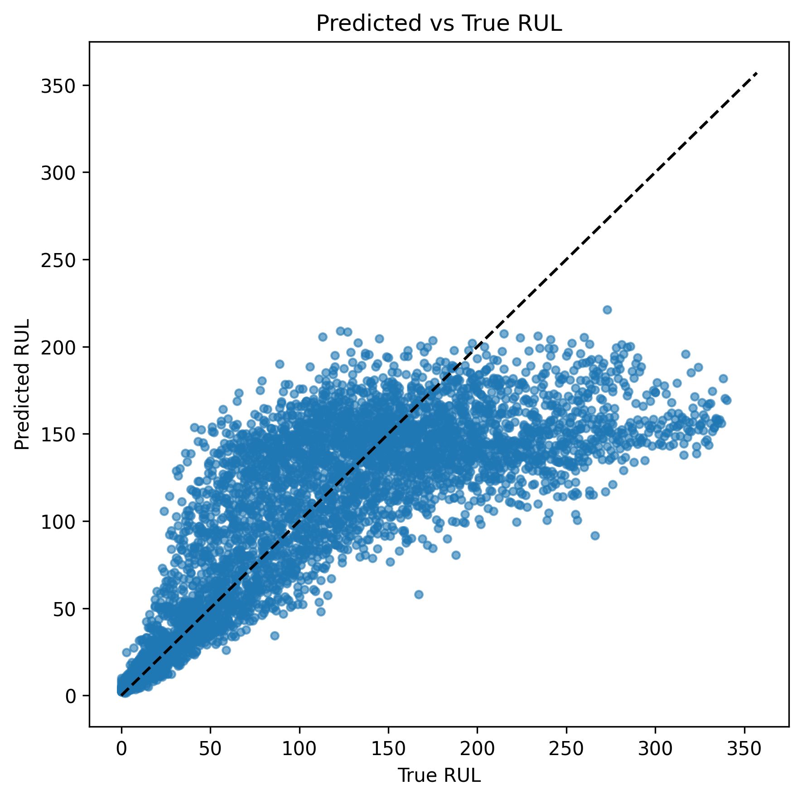
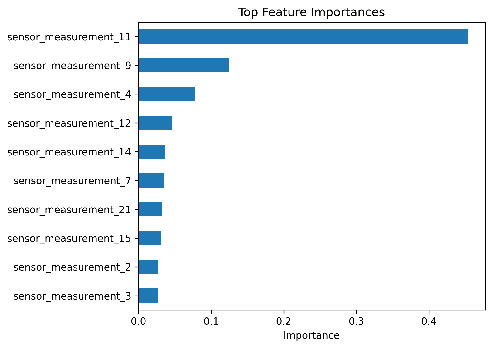

# MaintAI

MaintAI is a predictive maintenance project that estimates the **Remaining Useful Life (RUL)** of engines using NASA's CMAPSS dataset (FD001 subset).  
The goal is to predict how many cycles an engine has left before failure, which is directly relevant to reducing downtime in industrial automation.

---

## Project Structure
- `data/CMAPSS/` → dataset files (ignored in git, not provided here)
- `notebooks/` → exploratory analysis (EDA, first models)
- `src/` → reusable code (data loading, modeling, metrics, plotting)
- `main_train.py` → end-to-end pipeline script
- `results/` → generated metrics and plots

---

## Setup
```bash
# create virtual environment (first time only)
python -m venv .venv

# activate it (PowerShell)
.venv\Scripts\Activate

# install dependencies
pip install -r requirements.txt

# run full training + evaluation pipeline
python main_train.py
Evaluation metrics will be printed in the console.

Artifacts (plots + metrics CSV) are saved in the results/ folder.

Linear Regression baseline metrics are logged in results/metrics.csv.

Dataset
Source: NASA CMAPSS

Subset used: FD001 (single operating condition, one fault mode).

Training data: 100 engines run to failure.

Test data: engines 81–100 (held out).

Target: Remaining Useful Life (RUL), calculated as:
RUL = max_cycle_per_engine - current_cycle.

Methods
Baselines tested:

Linear Regression

RandomForest Regressor (n=400, random_state=42)

Features:

3 operational settings

21 sensor measurements (raw values, no rolling features in MVP)

Results
Test set (engines 81–100, last cycles):

Model	MAE (cycles)	RMSE (cycles)	R²
Linear Regression	38.66	53.14	0.5233
RandomForest	36.39	51.11	0.5649


Predicted vs True Remaining Useful Life (RandomForest)

  
*Predicted vs True Remaining Useful Life (RandomForest)*


Top feature importances from RandomForest

  
*Top feature importances from RandomForest*

Interpretation
Predictions are within ±36.39 cycles of the true RUL on average.

Sensor measurements like sensor_measurement_11, sensor_measurement_14, and operational settings were among the top features.

Performance is strong enough for maintenance planning windows of ~30–50 cycles.

RandomForest outperformed Linear Regression by capturing non-linear sensor–RUL relationships.

Next Steps
Add rolling-window features (mean, std, slope) to capture temporal trends more robustly.

Train an LSTM baseline on sequence windows to learn degradation patterns directly.

Compare with XGBoost and CNN/transformer-based time-series models.

Add a binary classifier for “failure soon” (e.g. RUL ≤ 30).

Explore drift monitoring and adaptation to other CMAPSS subsets (FD002–FD004).

License
MIT License