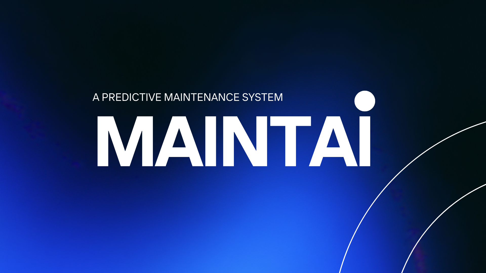
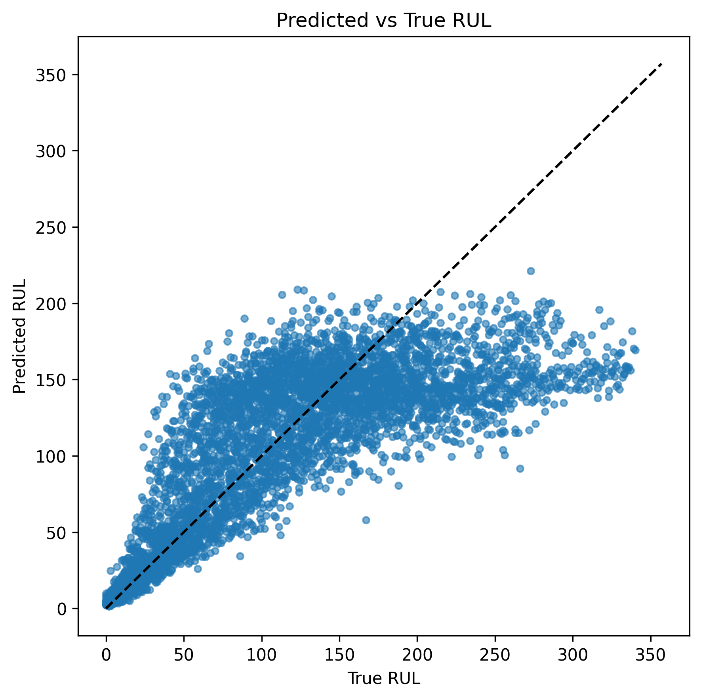
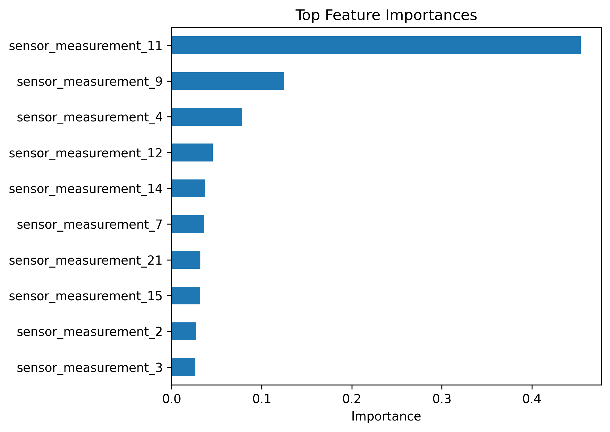
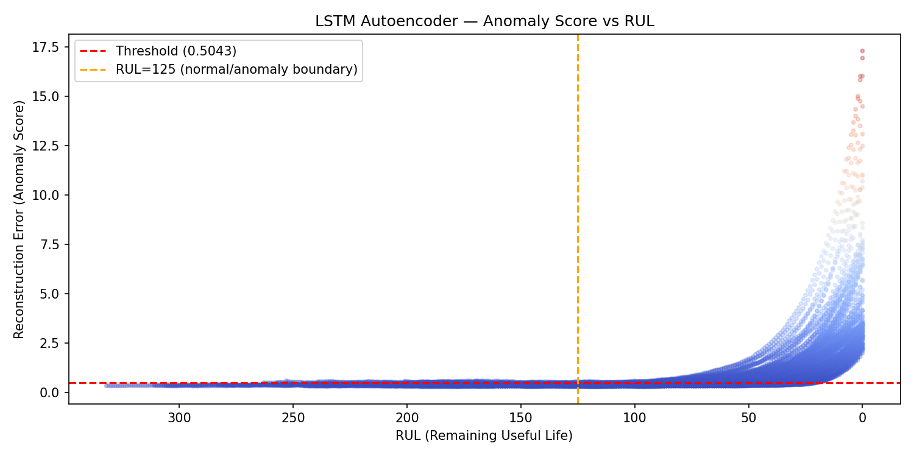

# MaintAI
<p align="center">
  
</p>

MaintAI is a predictive maintenance project with two complementary modules:

1. **RUL Regression** — estimates the Remaining Useful Life of jet engines using supervised ML
2. **Anomaly Detection** — detects degradation in engine sensor data using an LSTM Autoencoder (unsupervised)

Both modules use NASA's CMAPSS dataset (FD001 subset) and are built with PyTorch and scikit-learn.

---

## Project Structure

- `data/CMAPSS/` → dataset files (ignored in git, not provided here)
- `notebooks/` → exploratory analysis and model notebooks
  - `01_CMAPSS_RUL_BASELINE.ipynb` → EDA and baseline regression models
  - `02_Seq_LSTM_DL.ipynb` → LSTM-based RUL sequence model
  - `03_LSTM_autoencoder.ipynb` → LSTM Autoencoder for anomaly detection
- `src/` → reusable code (data loading, modeling, metrics, plotting)
- `main_train.py` → end-to-end RUL regression pipeline
- `results/` → generated metrics and plots

---

## Setup

```bash
# create virtual environment (first time only)
python -m venv .venv

# activate it (PowerShell)
.venv\Scripts\Activate

# install dependencies
pip install -r requirements.txt

# run full RUL regression pipeline
python main_train.py

# run anomaly detection notebook
# open notebooks/03_LSTM_autoencoder.ipynb in Jupyter
```

---

## Dataset

- **Source**: NASA CMAPSS
- **Subset used**: FD001 (single operating condition, one fault mode)
- **Training data**: 100 engines run to failure
- **Test data**: engines 81–100 (held out for RUL regression)
- **Target (regression)**: Remaining Useful Life (RUL), calculated as:

$$RUL = \text{max\_cycle\_per\_engine} - \text{current\_cycle}$$

---

## Module 1 — RUL Regression

### Methods

Baselines tested:

- **Linear Regression**
- **RandomForest Regressor** (`n=400`, `random_state=42`)

**Features:**
- 3 operational settings
- 21 sensor measurements (raw values)

### Results

Test set (engines 81–100):

| Model             | MAE (cycles) | RMSE (cycles) | R²     |
|-------------------|--------------|---------------|--------|
| Linear Regression | 38.66        | 53.14         | 0.5233 |
| RandomForest      | 36.39        | 51.11         | 0.5649 |

**Plots:**

<p align="center">
  <br>
  <em>Figure 1: RandomForest predicted vs true RUL</em>
</p>

<p align="center">
  <br>
  <em>Figure 2: Top feature importances from RandomForest</em>
</p>

### Interpretation

- Predictions are within ±36 cycles of true RUL on average.
- `sensor_measurement_11`, `sensor_measurement_14`, and operational settings were top features.
- Performance is sufficient for maintenance planning windows of ~30–50 cycles.
- RandomForest outperformed Linear Regression by capturing non-linear sensor–RUL relationships.

---

## Module 2 — LSTM Autoencoder Anomaly Detection

### Approach

Rather than predicting time-to-failure, this module detects *when* an engine starts deviating from normal behaviour — without any labelled fault data.

**Key idea:** Train an LSTM Autoencoder only on healthy engine cycles (RUL > 125). The model learns to compress and reconstruct normal sensor sequences through a 32-dimensional bottleneck. At inference time, healthy sequences reconstruct well (low error) while degrading sequences reconstruct poorly (high error). Reconstruction error is the anomaly score.

This is a **semi-supervised** approach — no anomaly labels required, only a clean window of normal operation data.

### Architecture

```
Input (30 timesteps × 24 features)
        ↓
  LSTM Encoder → hidden state (32-dim bottleneck)
        ↓
  LSTM Decoder → reconstructed sequence (30 × 24)
        ↓
  MSE(input, reconstruction) = anomaly score
```

### Implementation Details

- **Window size:** 30 consecutive cycles (sliding window, per-engine)
- **Bottleneck:** 32-dimensional hidden state
- **Training data:** Only cycles with RUL > 125 (healthy operation)
- **Scaler:** StandardScaler fitted on normal data only
- **Threshold:** 95th percentile of normal window reconstruction errors
- **Training:** 30 epochs, Adam optimizer (lr=1e-3), MSE loss
- **Framework:** PyTorch

### Results

<p align="center">
  <br>
  <em>Figure 3: Reconstruction error vs RUL across all engines. Red dashed line = anomaly threshold. Orange line = RUL=125 training boundary.</em>
</p>

### Interpretation

- Reconstruction error stays flat and below threshold for healthy engines (RUL > 125).
- Error rises sharply as engines degrade toward failure (RUL → 0), reaching up to 17× above the threshold.
- The model detects degradation without ever seeing a single labelled anomaly.
- This complements the RUL regression module — anomaly detection fires an early warning, while RUL regression estimates how much time remains.

---

## Next Steps

- Evaluate anomaly detection with precision, recall, and PR-AUC using RUL-derived ground truth labels.
- Test on other CMAPSS subsets (FD002–FD004) with multiple operating conditions.
- Add per-sensor reconstruction error attribution to identify which sensors drive each anomaly.
- Explore VAE (Variational Autoencoder) for probabilistic anomaly scoring.
- Package the anomaly detector as a reusable inference module with configurable threshold.

---

## License

MIT License